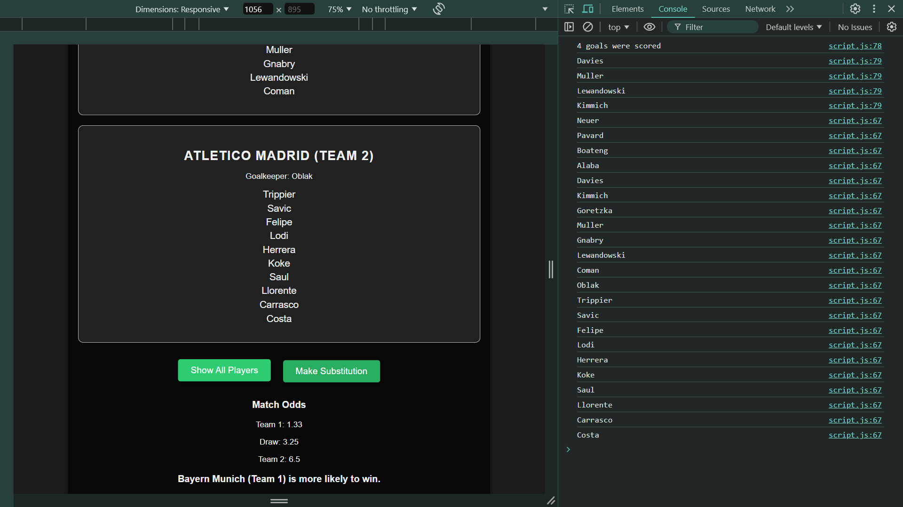

# Football Match Scoreboard

A simple web application to display a football match scoreboard, showcasing team rosters, match odds, and features like substitutions and goal tracking. This project is built with HTML, CSS, and JavaScript.

## Features

- Displays team names and current scores
- Lists players for each team, including goalkeepers and field players
- Shows betting odds for each team and draw
- Allows users to make substitutions and see the updated player list
- Tracks and logs goals scored by players
- Responsive design for mobile and desktop views

## Screenshots

Here are some screenshots of the application:

### Home Page 


### Scored Players 


### Team Players


## Technologies Used

- HTML
- CSS
- JavaScript

## Getting Started

1. Clone the repository to your local machine using:
   ```bash
   git clone https://github.com/MoSalem149v2/football-match-scoreboard_DEBI-Task.git
